# Google Summer of Code 2026 Proposal

## GTK4 Transition Part 2: Sugar Shell

### Migrating Core Sugar Shell Components from GTK3 to GTK4

---

**Organization:** Sugar Labs  
**Submitted by:** Dev

## 1. About Me

| Field                 | Details                                                                        |
| :-------------------- | :----------------------------------------------------------------------------- |
| **Name**              | Dev                                                                            |
| **Degree**            | B.Tech in Computer Science                                                     |
| **Current Role**      | Undergraduate Student                                                          |
| **Email**             | kalpanagola9897@gmail.com                                                      |
| **Phone**             | +91 8077907751                                                                 |
| **GitHub**            | [https://github.com/dev10-sys](https://github.com/dev10-sys)                   |
| **LinkedIn**          | [https://www.linkedin.com/in/dev10-sys](https://www.linkedin.com/in/dev10-sys) |
| **Matrix**            | Dev (@dev10-sys:matrix.org)                                                    |
| **Time Zone**         | IST (GMT +5:30)                                                                |
| **Coding Mentors**    | Krish Pandya, Ibiam Chihurumnaya                                               |
| **Assisting Mentors** | Walter Bender, Juan Pablo Ugarte                                               |

## Table of Contents

1. [About Me](#about-me)
2. [Previous Open Source Work](#previous-open-source-work)
3. [Abstract](#abstract)
4. [Problem Statement](#problem-statement)
5. [Project Details](#project-details)
6. [Impact on Sugar Labs](#impact-on-sugar-labs)
7. [Technologies Used](#technologies-used)
8. [Deliverables and Expected Results](#deliverables-and-expected-results)
9. [Migration Risks and Challenges](#migration-risks-and-challenges)
10. [Project Timeline and Schedule of Deliverables](#project-timeline-and-schedule-of-deliverables)
11. [Why This Project is Important Right Now](#why-this-project-is-important-right-now)
12. [Why I Am a Good Fit for This Project](#why-i-am-a-good-fit-for-this-project)
13. [Post GSoC Long Term Plans with Sugar Labs](#post-gsoc-long-term-plans-with-sugar-labs)

## 2. Previous Open Source Work

I have been contributing to Sugar Labs repositories, mainly focusing on the Sugar desktop environment and core shell components. My work includes fixing runtime issues, improving stability, fixing UI behavior issues, and working on GTK related migration and Wayland compatibility changes. I have worked on different parts of the Sugar desktop such as Journal, Frame, Clipboard, Control Panel, Datastore integration, and GTK related components. Along with Sugar desktop, I have also contributed to other Sugar Labs projects and open source networking test infrastructure.

### Contributions Table (Sugar Desktop – sugarlabs/sugar)

| Area              | Issue                         | What I Did                                                                                          | PR Link                                                                                      | Status |
| :---------------- | :---------------------------- | :-------------------------------------------------------------------------------------------------- | :------------------------------------------------------------------------------------------- | :----- |
| Datastore / DBus  | Datastore restart crash       | Fixed stale DBus proxy issue and implemented automatic reconnection and retry logic                 | [https://github.com/sugarlabs/sugar/pull/1030](https://github.com/sugarlabs/sugar/pull/1030) | Merged |
| Wayland Stability | Clipboard tray display issue  | Moved screen size lookup from import time to initialization to avoid Wayland startup crash          | [https://github.com/sugarlabs/sugar/pull/1059](https://github.com/sugarlabs/sugar/pull/1059) | Merged |
| Wayland Stability | Runtime display access crash  | Added guards for Gdk.Display and Gdk.Screen to prevent crashes during early startup                 | [https://github.com/sugarlabs/sugar/pull/1060](https://github.com/sugarlabs/sugar/pull/1060) | Merged |
| Control Panel     | Modem configuration crash     | Prevented crash when ISO country name missing by adding fallback to country code                    | [https://github.com/sugarlabs/sugar/pull/1061](https://github.com/sugarlabs/sugar/pull/1061) | Merged |
| Control Panel     | Excess disk writes            | Reused Gio.Settings instance to prevent repeated disk writes when moving age slider                 | [https://github.com/sugarlabs/sugar/pull/1063](https://github.com/sugarlabs/sugar/pull/1063) | Merged |
| Journal UI        | Activity chooser modal issue  | Set ActivityChooser transient for Journal window to ensure correct modal behavior                   | [https://github.com/sugarlabs/sugar/pull/1062](https://github.com/sugarlabs/sugar/pull/1062) | Open   |
| Frame / Clipboard | Clipboard paste failure       | Fixed paste failure when multiple clipboard items exist                                             | [https://github.com/sugarlabs/sugar/pull/1064](https://github.com/sugarlabs/sugar/pull/1064) | Open   |
| Journal           | Search focus lost             | Preserved search entry focus during async model refresh                                             | [https://github.com/sugarlabs/sugar/pull/1065](https://github.com/sugarlabs/sugar/pull/1065) | Open   |
| GTK4 Migration    | GTK3 deprecated API migration | Migrated deprecated GTK3 container, layout, and display APIs to GTK4 equivalents across Sugar shell | [https://github.com/sugarlabs/sugar/pull/1092](https://github.com/sugarlabs/sugar/pull/1092) | Open   |
| GTK4 Migration    | GTK4 container migration      | Replaced Gtk.VBox, Gtk.HBox, Gtk.Alignment, Gtk.EventBox and old container APIs                     | [https://github.com/sugarlabs/sugar/pull/1093](https://github.com/sugarlabs/sugar/pull/1093) | Open   |

### Other Sugar Labs Contributions (Music Blocks)

| Project         | Work                                                  | PR Link                                                                                                              | Status |
| :-------------- | :---------------------------------------------------- | :------------------------------------------------------------------------------------------------------------------- | :----: |
| Music Blocks v4 | Cooperative scheduler and execution monitoring system | [https://github.com/sugarlabs/musicblocks-v4-lib/pull/149](https://github.com/sugarlabs/musicblocks-v4-lib/pull/149) |  Open  |
| Music Blocks v4 | Recursive routine execution with call frame stack     | [https://github.com/sugarlabs/musicblocks-v4-lib/pull/151](https://github.com/sugarlabs/musicblocks-v4-lib/pull/151) |  Open  |
| Music Blocks v4 | Variable tables by data type namespace                | [https://github.com/sugarlabs/musicblocks-v4-lib/pull/152](https://github.com/sugarlabs/musicblocks-v4-lib/pull/152) |  Open  |

### Other Open Source Contributions (SONiC Networking)

| Project                   | Work                                                                             | PR Link                                                                                                  | Status |
| :------------------------ | :------------------------------------------------------------------------------- | :------------------------------------------------------------------------------------------------------- | :----- |
| SONiC Test Infrastructure | Added IPv6 support for COPP tests and extended VOQ tests for single ASIC systems | [https://github.com/sonic-net/sonic-mgmt/pull/23181](https://github.com/sonic-net/sonic-mgmt/pull/23181) | Open   |
| SONiC Test Infrastructure | Extended VOQ counter test to support single ASIC systems                         | [https://github.com/sonic-net/sonic-mgmt/pull/23171](https://github.com/sonic-net/sonic-mgmt/pull/23171) | Open   |

These SONiC PRs add IPv6 support and extend test coverage for single ASIC VOQ systems.

Through these contributions, I have worked on different layers of the Sugar desktop including UI behavior, system integration, runtime stability, and ongoing GTK4 migration work. This experience helped me understand the Sugar shell architecture and the challenges involved in migrating a large GTK3 codebase to GTK4 while maintaining stability.

## 3. Abstract

The Sugar desktop environment currently depends on GTK3 and X11, both of which are being replaced by GTK4 and Wayland in modern Linux systems. This creates compatibility, maintenance, and stability challenges for the Sugar Shell, which is the core component responsible for the Frame, Journal, activity launching, and system integration.

The goal of this project is to migrate the Sugar Shell from GTK3 to GTK4 and improve its compatibility with Wayland. This includes replacing deprecated GTK3 APIs, updating display and input handling, migrating styling systems to GTK CSS, and fixing X11-specific assumptions that do not work under Wayland.

Since the Sugar Shell is the base layer on which activities depend for launching, datastore access, and system services, stabilizing the Shell on GTK4 will make future activity migration and full Wayland support easier and more reliable.

The work will be implemented and tested using Sugar Live Build, and testing will be performed on both X11 and Wayland environments to ensure stability and compatibility. I will implement changes in small incremental patches and test continuously on both X11 and Wayland to ensure system stability during the migration process.

This project focuses specifically on the Sugar Shell because the Shell is the base environment where all activities run. Stabilizing the Shell on GTK4 is required before the full ecosystem transition can move forward. The migration will be done step by step while keeping the system usable during the transition.

The goal is to make the Sugar Shell stable on GTK4 first so that activity migration and full Wayland support can continue on top of a stable platform. This project focuses on stability, compatibility, and long-term maintainability rather than only visual changes.

## 4. Problem Statement

The Sugar Shell is a full desktop environment built primarily using Python and PyGObject on top of GTK3. While GTK3 has been stable for many years, it is now approaching end-of-life, and the Linux desktop ecosystem is moving towards GTK4 and Wayland. This creates several technical challenges for the Sugar Shell.

One of the major issues is that many parts of the Sugar Shell depend on GTK3 APIs that are deprecated or removed in GTK4. These include container APIs such as pack_start/pack_end, widgets such as Gtk.EventBox and Gtk.Alignment, old styling methods like modify_bg/modify_fg, and legacy event signals such as key-press-event and button-press-event. These APIs must be replaced with GTK4 layout APIs, event controllers, and CSS-based styling.

Another major issue is the dependency on X11-specific behavior. The Sugar Shell currently uses several X11-based concepts such as global screen geometry, window positioning using window.move(), foreign window embedding using Gdk.WindowType.FOREIGN, and input-only windows such as Gtk.Invisible for hot corners. These concepts do not work under Wayland because Wayland restricts global screen access, window positioning, and foreign window manipulation for security reasons.

From studying the Sugar Shell codebase, I found that one of the most critical technical issues is the use of Gdk.Screen APIs across many parts of the system. These APIs are removed in GTK4 and must be replaced with the Gdk.Display and monitor-based geometry system. If this is not handled correctly, the Sugar Shell can crash at startup, especially under Wayland.

Another complex component is the Frame system, which depends heavily on screen geometry, window positioning, and input events for edge activation and panel positioning. Since Wayland does not allow applications to freely move windows or control global window stacking, the Frame system must be carefully redesigned to work correctly in a Wayland environment.

The Sugar Shell is also tightly integrated with DBus services for activity lifecycle management, Journal access, datastore communication, and system services like NetworkManager and GSettings. The GTK4 migration must ensure that these DBus-based workflows continue to work correctly and that activity launching, switching, and stopping are not affected by the migration.

Because the Sugar Shell manages the full activity lifecycle, any instability in the Shell affects the entire system. Therefore, the migration must be done in a structured way so that the system remains usable and stable during the transition from GTK3 to GTK4 and from X11 to Wayland. Another important challenge is that GTK4 uses a different rendering model and input handling system, so parts of the Sugar Shell that depend on old event signals and drawing methods must be updated to GTK4 event controllers and modern rendering APIs.

Another important aspect is that the Sugar Shell manages the activity lifecycle through DBus and keeps track of running activities, focus, and Journal entries. During the GTK4 migration, this lifecycle management must continue to work correctly so that activities can start, stop, resume, and save data without breaking the user workflow.

### Why the Sugar Shell Must Be Migrated First

From my understanding of the Sugar architecture, the Shell is responsible for activity lifecycle management, Journal integration, datastore communication, and the main user interface. Activities depend on the Shell for launching, saving work, accessing the Journal, and interacting with system services.

Because of this dependency, if the Shell is not stable on GTK4 and Wayland, activity migration alone will not be enough. Activities may run, but integration issues, display issues, and lifecycle issues can still occur if the Shell is not fully compatible with GTK4 and Wayland.

Therefore, I see the GTK4 migration of the Sugar Shell as a platform layer migration. Once the Shell is stable, activity migration and full Wayland support become easier and more reliable.

#### Summary of Technical Challenges

| Area | Problem |
|------|---------|
| GTK3 APIs | Deprecated and removed in GTK4 |
| Display Handling | Gdk.Screen removed |
| Event System | Old event signals removed |
| Styling | Old styling APIs removed |
| X11 Dependencies | Not supported in Wayland |
| Frame System | Depends on screen geometry and positioning |
| DBus Integration | Must continue working after migration |

## 5. Project Details

### What are you making

In this project I am working on migrating the Sugar Shell from GTK3 to GTK4 and improving its compatibility with Wayland based Linux systems.

From what I have studied while working on the Sugar desktop, the Sugar Shell is the core environment that manages the user interface, activity launching, Journal, and system integration. Right now most of the Sugar Shell is still based on GTK3 and some parts assume X11 behavior.

From the issues I worked on, I noticed that the main problem is not only deprecated APIs but the platform change from X11 to Wayland and from GTK3 to GTK4. The Linux desktop ecosystem is moving towards GTK4 and Wayland, and if Sugar stays on GTK3 and X11, it will become harder to run and maintain Sugar on modern systems.

The goal of this project is not to change how Sugar looks or behaves for users, but to update the underlying GTK layer so that the Sugar Shell can run on GTK4 and work correctly on modern Linux systems.

The main parts I will be working on are the Frame, Journal, Clipboard, Control Panel, and Activity launching system, because these components form the core of the Sugar desktop environment.

Since Sugar is a full desktop environment and not just a single application, changes in the shell can affect multiple components. So my approach will be to migrate small parts, test them in a running Sugar session, and only then move to the next component.

From my understanding of the current GTK4 transition work and discussions in the Sugar community, migrating the Sugar Shell is a foundational step. Once the Shell is stable on GTK4, activities can be migrated more easily and Wayland support becomes more practical. Therefore this project focuses on the Shell as the base platform for the overall GTK4 and Wayland transition.

My approach is to treat this project as a system migration and stabilization project rather than only a UI migration project, because the Sugar Shell interacts with DBus services, the datastore, activities, and system components. So the migration must be done carefully to maintain system stability while updating the GTK layer.

This project is not only a UI migration but a platform migration of the Sugar Shell so that the entire Sugar desktop environment can continue to work on modern Linux systems.

### System Architecture Overview

Before explaining the migration work, I want to explain how the Sugar system is structured, because the migration work depends on how different parts of the system interact with each other.

#### Sugar System Architecture

The Sugar Shell is written mostly in Python and uses PyGObject to interact with GTK. GTK then interacts with the display server which can be X11 or Wayland. The Sugar Shell also communicates with system services like DBus, GSettings, NetworkManager, and the Sugar Datastore.
This means the Sugar Shell sits between the user and the Linux system and acts as the main environment where everything runs.

*Figure 1: Overall Sugar System Architecture showing how the Sugar Shell connects the user interface, system services, and activities through GTK and DBus.*

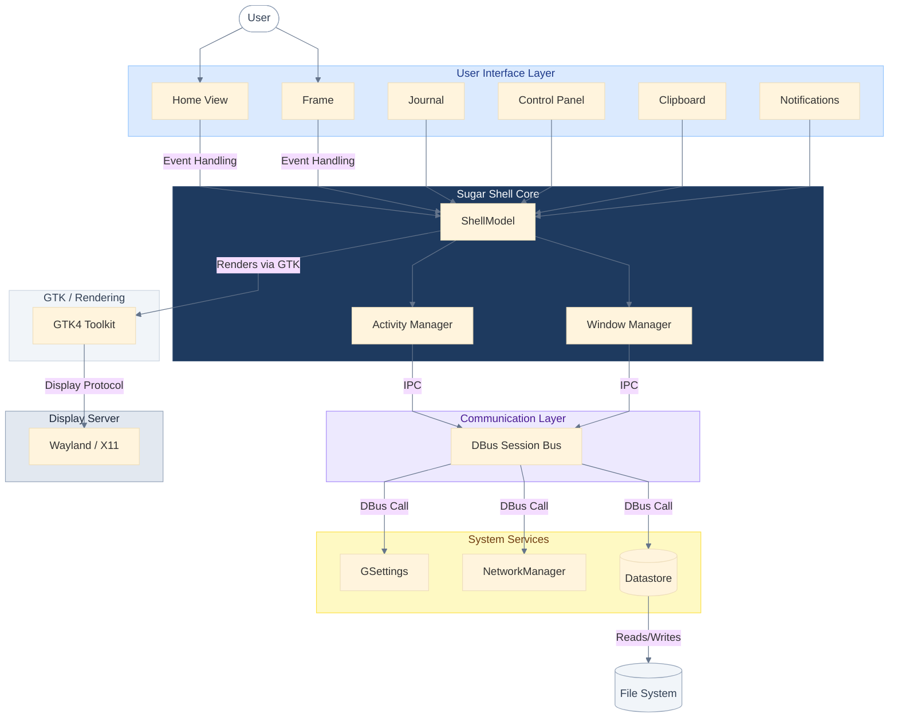

_This diagram shows how the Sugar system is structured. The Sugar Shell sits between the user and the Linux system. It uses GTK for the user interface and communicates with system services using DBus. Activities, Journal, Datastore, NetworkManager, and Notifications all communicate with the Sugar Shell through DBus. This shows that the Sugar Shell is the central layer of the system._

### How Activities Depend on the Sugar Shell

This is important because the GTK4 migration of the Shell also affects activities.

From this architecture, I understand that activities do not run independently. They depend on the Sugar Shell for launching, saving data, accessing the Journal, clipboard, and network services.

Because of this, I think that migrating the Sugar Shell to GTK4 is a base step. Once the Shell is stable on GTK4, activities can run on top of a GTK4 environment and activity migration becomes easier and more stable.

This diagram shows how activities are launched and managed through the Sugar Shell.

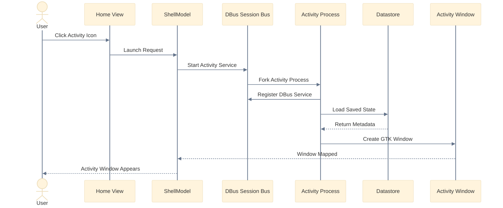

*Figure 2: How activities are launched and managed through the Sugar Shell.*

### GTK3 to GTK4 Migration Architecture

Now the migration itself is not just replacing widgets. It is a transition from an older GTK3 and X11 based architecture to a GTK4 and Wayland compatible architecture.

In GTK3 many APIs like old container widgets, screen based display handling, and some styling methods are deprecated. GTK4 uses new container APIs, event controllers, CSS based styling, and different display handling methods which are more compatible with Wayland.
So this migration involves updating container APIs, layout handling, display handling, styling, and input handling so that the Sugar Shell works correctly on GTK4.

This diagram shows how deprecated GTK3 APIs are mapped to GTK4 equivalents.

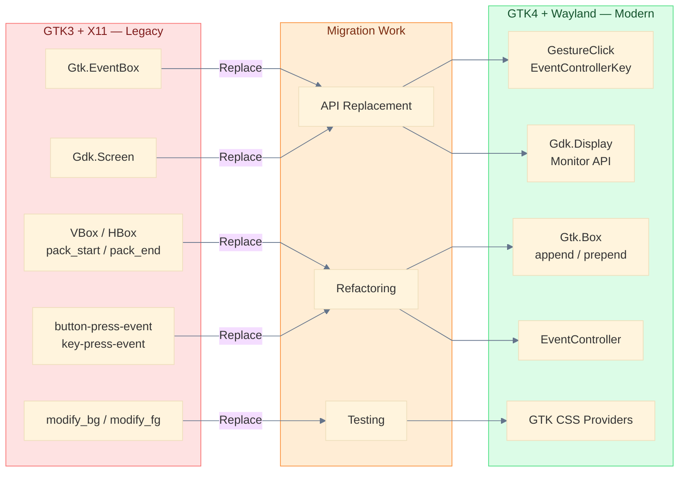

*Figure 3: GTK3 to GTK4 Mapping showing deprecated APIs and their modern replacements.*

### Internal Sugar Shell Components

To make the migration structured, I will work component by component inside the Sugar Shell.

This diagram shows the internal structure of the Sugar Shell and its main components.

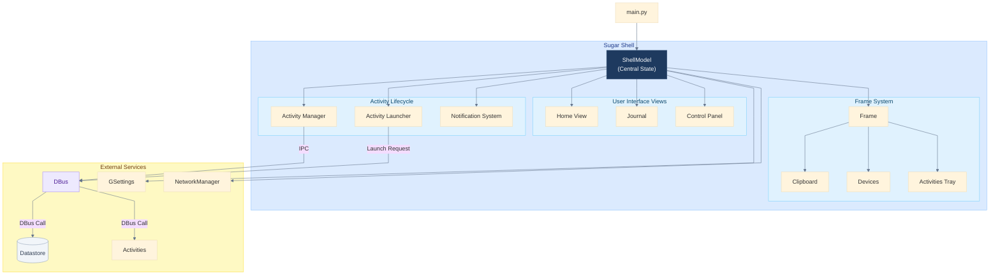

*Figure 4: Internal structure of the Sugar Shell components managed by the ShellModel.*

This helps in planning the migration because each of these components uses GTK widgets and display handling in different ways.

### DBus Communication Architecture

Sugar components communicate using DBus, especially for launching activities and accessing the datastore.

This diagram shows how different Sugar components communicate using DBus.

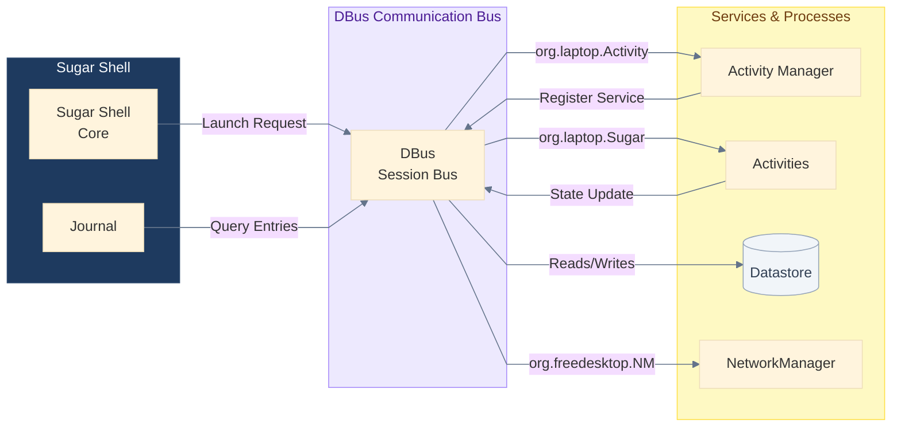

*Figure 5: DBus communication architecture for activity launching and Datastore integration.*

This is important because GTK4 migration should not break DBus communication or activity lifecycle.

### What Work Will Be Done

I will divide the work into several technical parts.

This diagram shows the step-by-step migration plan for GTK4 transition.

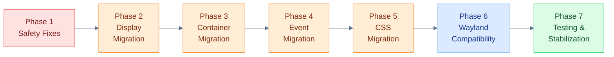

*Figure 6: Phased migration strategy for the Sugar Shell GTK4 transition.*

I will migrate and test the system at the same time. After each migration phase, I will run the Sugar Shell and test activity launch, Journal, Frame, and Control Panel on both X11 and Wayland to make sure the system remains stable.

One of the most complex parts of this migration is the Frame system because it depends on screen geometry, window positioning, focus handling, and input events. These areas are affected by GTK4 API changes and Wayland restrictions, so the Frame must be migrated and tested very carefully.

**1. GTK4 API Migration**
I will replace deprecated GTK3 APIs with GTK4 equivalents. This includes container APIs, layout APIs, widget APIs, and dialog APIs. This work will be done component by component in the Sugar Shell.

**2. Display and Monitor Handling**
GTK4 uses a different display and monitor system compared to GTK3. Old screen based APIs need to be replaced with GTK4 display and monitor APIs. This is important for Wayland compatibility.

**3. Styling Migration**
Old styling methods are deprecated in GTK4, so styling will be migrated to GTK CSS using CSS providers.

**4. Wayland Compatibility**
Some parts of Sugar assume X11 behavior. These parts need to be updated so that Sugar works correctly under Wayland where some X11 specific features are not available.

**5. Testing and Stability**
After migration, I will test the Frame, Journal, Clipboard, Control Panel, and Activity launching system to make sure the system works correctly and does not crash.

I will discuss each migration step with mentors before starting large changes, and I will submit changes in small pull requests so that each change can be reviewed and tested properly.

### Technical Implementation Plan

#### 1. Migration Strategy Overview

| Phase       | Area         | Main Work                                 | Risk Level | Output                        |
| :---------- | :----------- | :---------------------------------------- | :--------- | :---------------------------- |
| **Phase 1** | Safety Fixes | Remove crashes, import-time display calls | High       | Shell boots safely            |
| **Phase 2** | Display API  | Replace Gdk.Screen with Gdk.Display       | High       | Wayland-safe display handling |
| **Phase 3** | Containers   | Replace GTK3 container APIs               | Medium     | UI works on GTK4              |
| **Phase 4** | Events       | Replace old event signals                 | Medium     | Input works correctly         |
| **Phase 5** | Styling      | GTK CSS migration                         | Low        | UI styling works              |
| **Phase 6** | Wayland      | Remove X11 assumptions                    | High       | Wayland compatibility         |
| **Phase 7** | Testing      | Stability and regression testing          | High       | Stable Shell                  |

#### 2. Component Migration Priority

| Priority | Component         | Reason                                  |
| :------- | :---------------- | :-------------------------------------- |
| **1**    | Frame System      | Most dependent on screen, window, input |
| **2**    | Home View         | Main desktop UI                         |
| **3**    | Activity Launcher | Needed for launching activities         |
| **4**    | Journal           | Large but separate component            |
| **5**    | Control Panel     | Uses deprecated widgets                 |
| **6**    | Clipboard         | Small but display dependent             |

#### 3. GTK3 to GTK4 API Migration Plan

| GTK3 API                  | GTK4 Replacement            | Where Used        |
| :------------------------ | :-------------------------- | :---------------- |
| `Gtk.Box.pack_start`      | `Gtk.Box.append`            | All UI files      |
| `Gtk.Box.pack_end`        | `Gtk.Box.prepend`           | Launcher, Journal |
| `Gtk.EventBox`            | `Gtk.Box` + EventController | Frame, Journal    |
| `Gtk.Alignment`           | `Gtk.Box` + align/margin    | Journal, Launcher |
| `Gtk.Table`               | `Gtk.Grid`                  | Control Panel     |
| `Gtk.HSeparator`          | `Gtk.Separator`             | Control Panel     |
| `Gdk.Screen`              | `Gdk.Display` + Monitor     | Frame, Home       |
| `modify_bg` / `modify_fg` | CSS Provider                | Home, Launcher    |
| `key-press-event`         | `EventControllerKey`        | Home, Journal     |
| `button-press-event`      | `GestureClick`              | Frame             |
| `Gtk.AccelGroup`          | `ShortcutController`        | Home              |
| `Gtk.Invisible`           | Wayland alternative         | Frame             |

#### 4. Wayland Compatibility Plan

| X11 Method              | Problem       | Wayland Solution           |
| :---------------------- | :------------ | :------------------------- |
| `window.move()`         | Not allowed   | Use compositor positioning |
| `Gdk.Screen.width()`    | Removed       | Use monitor geometry       |
| Foreign windows         | Not supported | Remove dependency          |
| `Gtk.Invisible`         | Not supported | Use event controllers      |
| Pointer global position | Restricted    | Use local widget events    |

#### 5. Implementation Workflow

This diagram shows how development, testing, and review will be handled during the project.

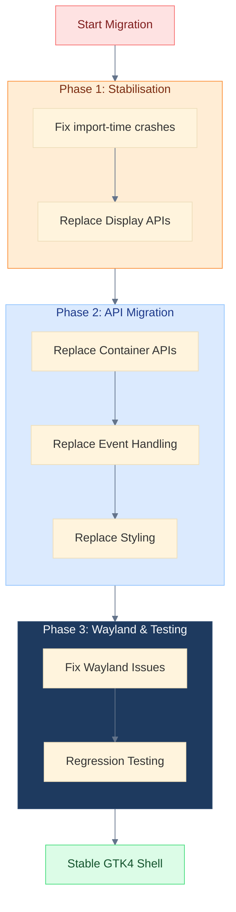

#### 6. Development and Contribution Workflow

This diagram shows how development, testing, and review will be handled during the project.
```mermaid
%%{init: {'theme': 'base', 'themeVariables': {'lineColor': '#64748b'}, 'flowchart': {'curve': 'linear'}}}%%
flowchart LR
    Start(["Pick Component"])

    subgraph Dev ["Development"]
        direction LR
        B["Study Code"]
        C["Migrate APIs"]
        D["Build"]
        B --> C --> D
    end

    subgraph Test ["Testing"]
        direction LR
        E["Test X11"]
        F["Test Wayland"]
        G["Fix Issues"]
        E --> F --> G
    end

    subgraph Review ["Review"]
        direction LR
        H["Pull Request"]
        I["Code Review"]
        J["Merge"]
        H --> I --> J
    end

    Next(["Next Component"])

    Start --> Dev --> Test --> Review --> Next
    Next -.->|"Iterate"| Start

    style Start fill:#dbeafe,stroke:#93c5fd,color:#1e3a8a
    style Next fill:#dcfce7,stroke:#4ade80,color:#14532d
    style Dev fill:#ffedd5,stroke:#fb923c,color:#7c2d12
    style Test fill:#1e3a5f,stroke:#2d4a6f,color:#f8fafc
    style Review fill:#ede9fe,stroke:#a78bfa,color:#4c1d95
```

#### 7. Testing Plan

| Component           | Test                             |
| :------------------ | :------------------------------- |
| **Frame**           | Edge activation, panel show/hide |
| **Home View**       | Favorites view, list view        |
| **Journal**         | Open, save, object chooser       |
| **Activity Launch** | Launch and stop activity         |
| **Clipboard**       | Copy paste between activities    |
| **Control Panel**   | Settings save                    |
| **Wayland**         | Shell startup without crash      |
| **DBus**            | Activity lifecycle               |

## 6. Impact on Sugar Labs

Migrating the Sugar Shell to GTK4 enables the transition for the entire Sugar ecosystem. Activities depend on the Sugar Shell for launching, window management, datastore access, Journal integration, and system services.
Because of this, once the Shell runs on GTK4 and Wayland, activities can be migrated and tested on a stable GTK4 environment.

Right now many Linux distributions have already moved to Wayland and GTK4, but Sugar is still mostly based on GTK3 and X11.

This diagram explains why X11-based behavior must be updated for Wayland compatibility.

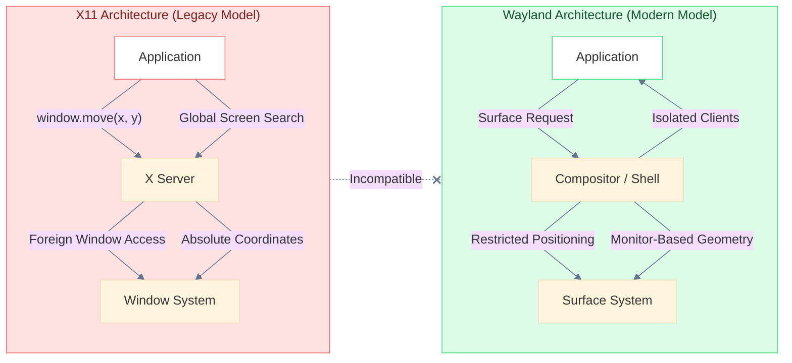

*Figure 7: Impact of Wayland restrictions on legacy X11-based window handling.*

If Sugar is not migrated, it may face compatibility and maintenance problems in the future.
So I see this project not just as a UI migration, but as a platform transition. This work helps Sugar run on modern Linux systems, reduces technical debt in the Sugar Shell, and makes future development easier because new features can be built on GTK4 instead of maintaining deprecated GTK3 code.

## 7. Technologies Used

| Component                | Technology      |
| :----------------------- | :-------------- |
| **Programming Language** | Python 3        |
| **GUI Framework**        | GTK3 to GTK4    |
| **Python Bindings**      | PyGObject       |
| **Display Systems**      | Wayland and X11 |
| **IPC**                  | DBus            |
| **Settings**             | GSettings       |
| **Storage**              | Sugar Datastore |
| **Build System**         | Autotools       |
| **Styling**              | GTK CSS         |
| **Networking**           | NetworkManager  |

Most of the Sugar Shell code is written in Python and uses PyGObject to interact with GTK, so most of the migration work will involve updating GTK APIs and display handling in Python code.

## 8. Deliverables and Expected Results

By the end of this project, the following results are expected:

- Sugar Shell components such as **Frame**, **Home View**, **Journal**, **Clipboard**, **Control Panel**, and **Activity Launcher** run on GTK4.
- Deprecated GTK3 APIs in migrated components are replaced with GTK4 APIs.
- Sugar Shell starts and runs correctly on Wayland without display related crashes.
- Activity launch, Journal access, clipboard, and datastore operations work correctly after migration.
- The migration changes are documented so that other developers can continue migrating remaining components.

| Deliverable | Description |
|:------------|:------------|
| GTK4 Shell Build | Shell runs on GTK4 |
| **Frame** Migration | Frame works on GTK4 |
| **Journal** Migration | Journal works |
| **Clipboard** Migration | Clipboard works |
| **Control Panel** Migration | Settings UI works |
| Wayland Compatibility | Shell runs on Wayland |
| Documentation | Migration guide |
| Pull Requests | All work submitted |

The main goal is to make the Sugar Shell stable on GTK4 and compatible with Wayland so that future development can continue on modern Linux systems.

All migrated components will be tested in a running Sugar session, and the migration work will be submitted as multiple pull requests to the Sugar repository. The project will also include migration documentation so that other developers can continue migrating remaining components.

## 9. Migration Risks and Challenges

Migrating a desktop environment from GTK3 to GTK4 while also improving Wayland compatibility involves several risks and technical challenges.

One major challenge is that GTK4 removed several APIs that the Sugar Shell depends on, especially for event handling, container layouts, and display handling. Replacing these APIs requires careful testing to ensure that user interaction, keyboard shortcuts, and activity switching continue to work correctly.

Another challenge is the Wayland display model. Wayland does not allow global screen access, absolute window positioning, or foreign window embedding in the same way as X11. Some parts of the Sugar Shell such as the Frame, activity focus handling, and window tracking depend on these behaviors. These parts need to be redesigned or adapted to work correctly under Wayland restrictions.

There is also a stability risk during migration, because the Sugar Shell is the main environment where activities run. If the Shell crashes, the entire system becomes unusable. Therefore, the migration must be done in small steps with continuous testing instead of large changes.

To reduce these risks, I will migrate the Shell component by component, test each change in a running Sugar session, and submit small pull requests so that each change can be reviewed and tested before moving to the next component.

To reduce these risks, I will avoid large code changes and instead migrate the Shell in small steps. After each change, I will test the Shell in a running Sugar session and submit small pull requests for review. This reduces the risk of large regressions and makes debugging easier.

## 10. Project Timeline and Schedule of Deliverables

### Project Timeline Overview

| Phase | Dates | Focus Area |
|:------|:------|:-----------|
| Pre-Community Period | Before May 1 | Environment setup, architecture study |
| Community Bonding | May 1 – May 24 | Planning, design, initial fixes |
| Coding Phase 1 | May 25 – July 10 | Core GTK4 migration (Display, Containers, Events, Frame) |
| Midterm Evaluation | July 10 | Core Shell components migrated |
| Coding Phase 2 | July 11 – Aug 24 | Remaining components + Wayland fixes |
| Final Evaluation | Aug 24 | Testing, stabilization, documentation |

- *Figure 8: GSoC 2026 Sugar Shell GTK4 Migration Timeline (Gantt Chart View)*

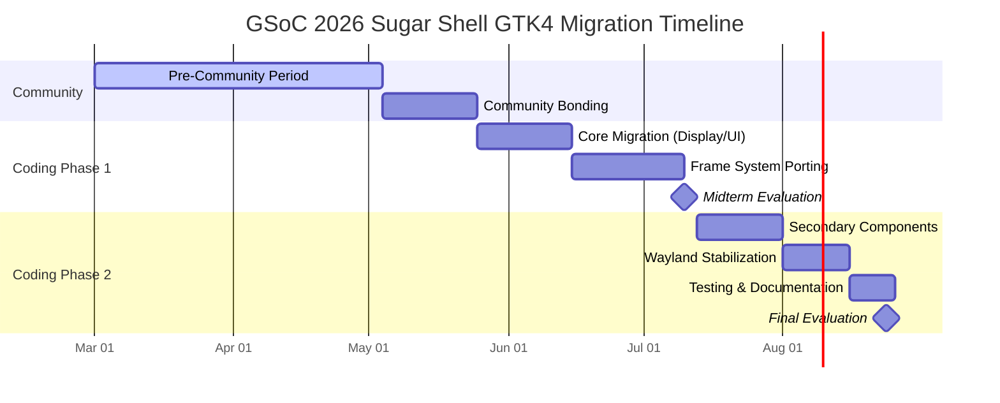

The following is a timeline for the project, broken down into specific phases and milestones:

- **10.0 Pre–Community Bonding Period**
- **10.1 Community Bonding Period (May 1 – May 24)**
- **10.2 Coding Period Phase 1 (May 25 – July 10)**
- **10.3 Midterm Evaluation Deliverables**
- **10.4 Coding Period Phase 2 (July 11 – August 24)**
- **10.5 Final Evaluation Deliverables**
- **10.6 Weekly Time Commitment**
- **10.7 Progress Reporting Plan**
- **10.8 Post GSoC Plans**

### 10.0 Pre–Community Bonding Period

Before the official community bonding period, I will continue contributing to the Sugar repository and focus on understanding the Sugar Shell architecture in detail. I will study the existing GTK3 code paths, identify areas that still depend on X11 specific APIs, and review the current progress of GTK4 migration in Sugar and related projects.

During this period, I will also complete the development environment setup for building and testing Sugar Shell from source using Sugar Live Build. I will test the Sugar Shell on both X11 and Wayland sessions to understand current compatibility issues and runtime behavior.

I will begin reviewing and documenting the GTK3 to GTK4 API changes that are relevant to Sugar Shell components such as the Frame, Home View, Journal, and Control Panel. This preparation will help in starting the coding phase earlier and reduce delays during the official coding period.

I also plan to continue submitting small patches and fixes related to GTK4 compatibility and Wayland safety so that I remain actively involved with the Sugar Labs development workflow before the coding period begins. If possible, I will also begin working on small GTK4 related patches during this period so that some migration work is already in progress before the official coding period begins.

### 10.1 Community Bonding Period (May 1 – May 24)

#### Week 1 (May 1 – May 7)

During this week, I will interact closely with my mentors and the Sugar Labs community to finalize the project scope and priorities for the GTK4 migration of the Sugar Shell. We will identify which components should be migrated first based on complexity and impact, with special focus on the Frame system, Journal integration, and Control Panel components. I will also finalize the communication schedule with mentors for weekly progress meetings.

#### Week 2 (May 8 – May 14)

In this week, I will prepare a detailed technical migration plan. This includes mapping GTK3 APIs currently used in Sugar Shell to their GTK4 equivalents, identifying deprecated APIs, and planning the migration strategy for display handling, input handling, and window management. I will also prepare a testing strategy for both X11 and Wayland environments.

#### Week 3 (May 15 – May 21)

During this week, I will begin working on small GTK4 migration tasks such as replacing deprecated GTK3 widgets, updating event handling to GTK4 Event Controllers, and removing minor X11 dependent code where possible. These initial changes will serve as preparation for the main migration work during the coding period.

#### Week 4 (May 22 – May 24)

In the final week of the community bonding period, I will finalize the repository workflow, testing workflow, and documentation structure for the project. I will ensure that the build environment, testing environment, and debugging tools are fully working so that the coding phase can begin smoothly on May 25.

### 10.2 Coding Period Phase 1 (May 25 – July 10)

```mermaid
%%{init: {'theme': 'base', 'themeVariables': {'lineColor': '#64748b'}, 'flowchart': {'curve': 'linear'}}}%%
flowchart LR
    Step1(["Display & UI Core"]) --> Step2(["Frame System"])
    Step2 --> Step3(["Journal & Launcher"])
    Step3 --> Step4(["Control Panel"])
    Step4 --> Step5(["Wayland Stabilization"])
    Step5 --> Step6(["Final Testing"])

    style Step1 fill:#f1f5f9,stroke:#94a3b8
    style Step2 fill:#ffedd5,stroke:#fb923c
    style Step3 fill:#dbeafe,stroke:#93c5fd
    style Step4 fill:#dbeafe,stroke:#93c5fd
    style Step5 fill:#1e3a5f,stroke:#2d4a6f,color:#ffffff
    style Step6 fill:#dcfce7,stroke:#4ade80
```

*Figure 9: GTK4 Migration Phases for Sugar Shell components.*

#### Week 5 (May 25 – May 31)

The coding period will begin with setting up a GTK4 development branch and ensuring that the Sugar Shell builds and runs correctly with the GTK4 environment. I will start with critical stability fixes such as removing import-time display access, fixing crashes related to display initialization, and ensuring that the Shell can start reliably. Before starting major migration work, I will ensure that the Sugar Shell starts reliably with GTK4 without crashes.

#### Week 6 (June 1 – June 7)

During this week, I will work on migrating display and monitor related APIs. This includes replacing deprecated Gdk.Screen APIs with Gdk.Display and monitor-based geometry APIs. This step is important for Wayland compatibility and for components such as the Frame and Home View which depend on screen geometry.

#### Week 7 (June 8 – June 14)

In this week, I will begin migrating GTK3 container APIs to GTK4 container and layout APIs. This includes replacing pack_start, pack_end, Gtk.EventBox, Gtk.Alignment, and other deprecated container widgets. The focus will be on the Home View and basic Shell UI components.

#### Week 8 (June 15 – June 21)

During this week, I will migrate event handling from old GTK3 event signals to GTK4 Event Controllers such as GestureClick and EventControllerKey. This is especially important for the Frame system, keyboard shortcuts, and activity switching behavior.

#### Week 9 (June 22 – July 10)

In this period, I will focus on migrating and testing the Frame system, since it is one of the most complex components and depends heavily on display geometry, input handling, and window behavior. The Frame will be tested carefully on both X11 and Wayland environments to ensure correct behavior.

### 10.3 Midterm Evaluation Deliverables

By the midterm evaluation, the following work is expected to be completed:

- GTK4 development environment set up and working Sugar Shell build.
- Display and monitor API migration from Gdk.Screen to Gdk.Display.
- Migration of GTK3 container APIs to GTK4 layout APIs in core Shell components.
- Migration of event handling to GTK4 Event Controllers.
- Partial migration and testing of the Frame system.
- Sugar Shell starts and runs without display related crashes.
- Basic testing completed on both X11 and Wayland environments.
- Initial migration documentation and testing notes.

| Component | Status |
|:----------|:-------|
| GTK4 Build | Working |
| Display Migration | Completed |
| Container Migration | Completed |
| Event Handling Migration | Completed |
| Frame Migration | Partial |
| X11/Wayland Testing | Initial Testing Done |
| Documentation | Started |

### 10.4 Coding Period Phase 2 (July 11 – August 24)

#### Week 10 (July 11 – July 17)

During this week, I will continue the migration of remaining Shell components such as the Journal and Activity Launcher. These components involve dialogs, object chooser, and activity lifecycle integration.

#### Week 11 (July 18 – July 24)

In this week, I will work on migrating Control Panel components and settings related UI, including deprecated GTK widgets and layout APIs used in the Control Panel.

#### Week 12 (July 25 – July 31)

During this week, I will migrate Clipboard, Notifications, and tray components. These components depend on display handling and event handling, so they will be tested carefully after migration.

#### Week 13 (August 1 – August 7)

This week will be focused on Wayland compatibility fixes. I will remove remaining X11 specific assumptions and ensure that the Shell works correctly under Wayland restrictions.

#### Week 14 (August 8 – August 24)

In the final weeks, I will focus on testing, debugging, documentation, and stabilization. All migrated components will be tested in a running Sugar session, and regression testing will be performed to ensure that activity launching, Journal, and datastore functionality work correctly.

### 10.5 Final Evaluation Deliverables

By the final evaluation, the following deliverables will be completed:

- Frame, Home View, Journal, Control Panel, and Clipboard components migrated to GTK4.
- Deprecated GTK3 APIs replaced with GTK4 APIs in migrated components.
- Sugar Shell runs correctly on GTK4 in both X11 and Wayland sessions.
- Activity launching, Journal access, clipboard, and datastore functionality working after migration.
- Migration documentation explaining GTK3 to GTK4 changes.
- All changes submitted as pull requests to the Sugar repository.

| Component | Result |
|:----------|:-------|
| Frame | Migrated |
| Home View | Migrated |
| Journal | Migrated |
| Control Panel | Migrated |
| Clipboard | Migrated |
| Wayland Compatibility | Working |
| Documentation | Completed |
| Pull Requests | Submitted |

### 10.6 Weekly Time Commitment

I will be able to dedicate approximately 35 to 40 hours per week to this project. I plan to work around 5 to 6 hours per day on weekdays and additional time on weekends for testing, debugging, and documentation.

### 10.7 Progress Reporting Plan

I will maintain a weekly progress blog describing the work completed, challenges faced, and plans for the next week. I will also communicate regularly with my mentors through weekly meetings and submit pull requests frequently so that feedback can be incorporated early. Documentation of migration steps and technical decisions will be maintained throughout the project.

*Figure 10: Weekly development, testing, and mentor review cycle.*

### 10.8 Post GSoC Plans

After GSoC, I plan to continue contributing to Sugar Labs and complete any remaining GTK4 migration work in the Sugar Shell. I would also like to help in migrating more Sugar activities to GTK4 and improving Wayland compatibility. I plan to remain an active contributor in the Sugar Labs community and help new contributors get started with Sugar development.

## 11. Why This Project is Important Right Now

Stabilizing the Sugar Shell on GTK4 and Wayland is a foundational step for the entire Sugar desktop ecosystem.

- **Enabling Platform-wide Transition:** The Sugar Shell acts as the platform layer for all activities. If the Shell does not run correctly on GTK4 and Wayland, it blocks the transition for activities and downstream distributions.
- **Parallel Development:** Activity porting using `sugar-toolkit-gtk4` is already underway. A stable GTK4 Shell is required as a reliable testing environment for these modern activities.
- **Reducing Technical Debt:** As Linux distributions move away from X11 and GTK3, migrating the core Shell components ensures Sugar remains maintainable and compatible with modern hardware and software standards.

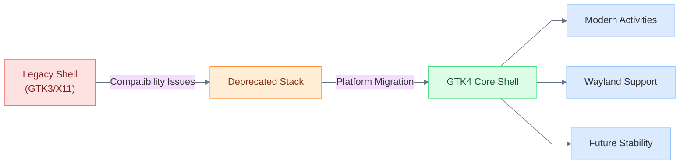

*Figure 11: Why GTK4 Shell Migration is Required for the Sugar Ecosystem.*

Since I am already working on the Sugar Shell codebase and submitting patches, I am familiar with the architecture, debugging process, and development workflow. This allows me to start working on the migration immediately and make steady progress throughout the coding period.

## 12. Why I Am a Good Fit for This Project

My existing contributions and technical understanding of the Sugar Shell make me well-prepared for this migration.

- **Direct Contribution History:** I have worked extensively on the Frame, Journal, Clipboard, Control Panel, and Datastore components, gaining a deep understanding of Shell architecture and DBus communication.
- **Bug-fixing Experience:** I have successfully patched runtime display access crashes, Wayland-specific startup issues, and deprecated GTK3 API usage in the Sugar repository.
- **GTK4 Experimentation:** I have already started experimenting with the `sugar-toolkit-gtk4` and activity migration to understand the practical challenges of drawing, input handling, and container layout changes.
- **Architectural Understanding:** I recognize the Sugar Shell as a full desktop environment with complex lifecycle management, which allows me to handle the migration with the necessary care for system stability.

I am already familiar with the Sugar development workflow, code review process, and debugging environment, so I can start contributing immediately without a long ramp-up period.

## 13. Post GSoC Long Term Plans with Sugar Labs

My commitment to Sugar Labs extends beyond the GSoC coding period.

- **Ongoing Maintenance:** I plan to finish any remaining GTK4 migration work and continue fixing bugs in the Shell even after the program ends.
- **Activity Porting Support:** I will assist in porting more Sugar activities to GTK4, ensuring they integrate seamlessly with the newly migrated Shell.
- **Mentoring & Onboarding:** I want to help new contributors understand the Sugar codebase, particularly in areas like GTK, activity management, and debugging, making it easier for others to join the project.
- **Sustained Community Engagement:** I intend to remain an active member of the community, taking on more responsibility in maintaining core components as I gain more experience.

In the long term, I would like to continue working on Sugar Shell stability and GTK4 migration and gradually take more responsibility in maintaining parts of the Sugar Shell and helping new contributors get started with Sugar development.

