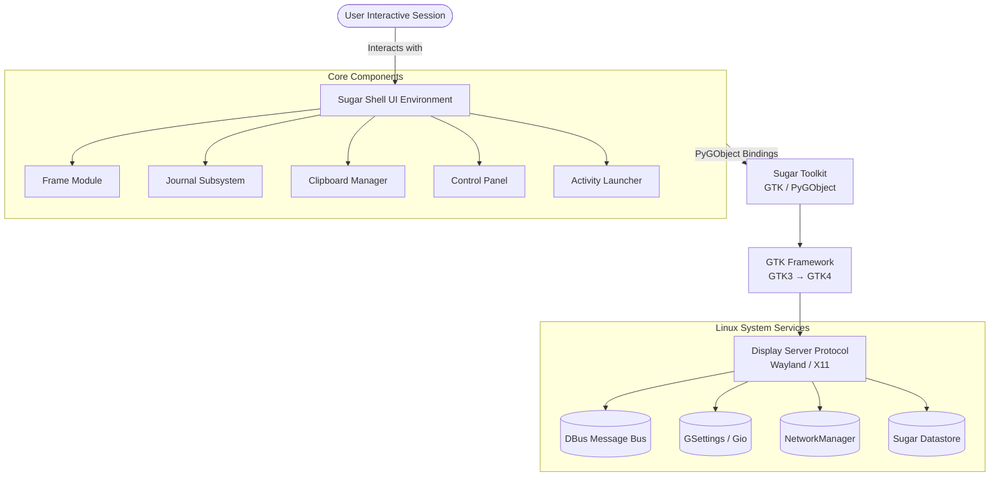
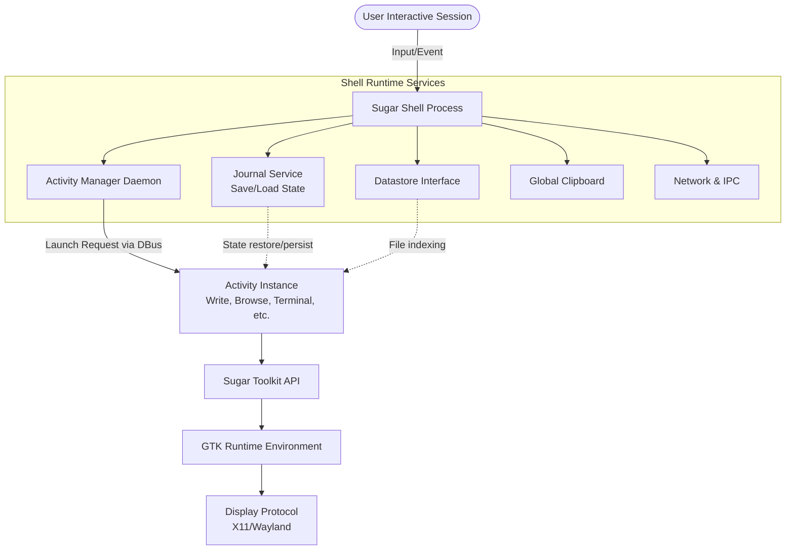
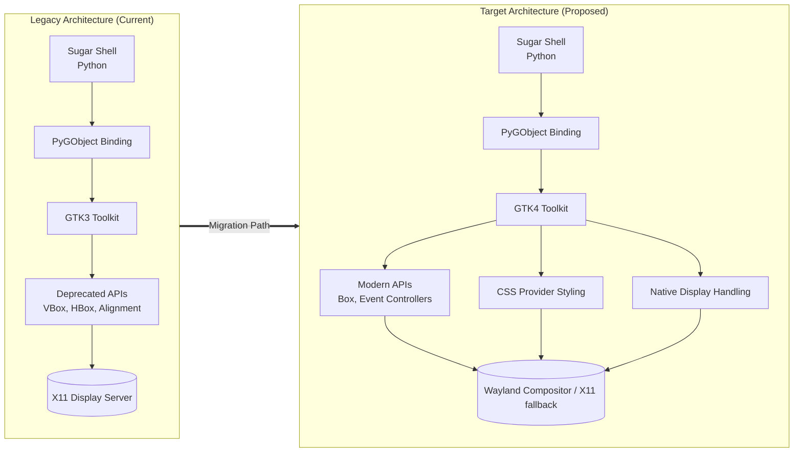
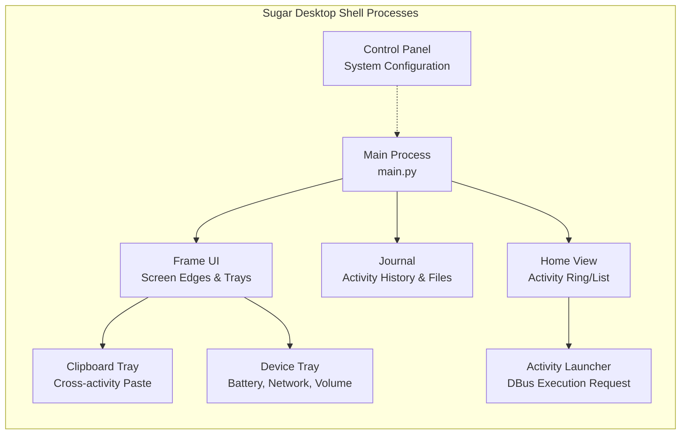
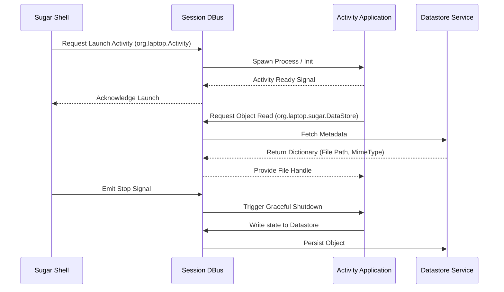

# Google Summer of Code 2026 Proposal

**Organization:** Sugar Labs  
**Project:** GTK4 Transition Part 2 Sugar Shell  
**Proposal Title:** Completing GTK4 Migration and Wayland Support for the Sugar Shell  
**Submitted by:** Dev  

## About Me

| Field | Details |
| --- | --- |
| **Name** | Dev |
| **Degree** | B.Tech in Computer Science |
| **Current Role** | Undergraduate Student |
| **Email** | kalpanagola9897@gmail.com |
| **Phone** | +91 8077907751 |
| **GitHub** | [https://github.com/dev10-sys](https://github.com/dev10-sys) |
| **LinkedIn** | [https://www.linkedin.com/in/dev10-sys](https://www.linkedin.com/in/dev10-sys) |
| **Matrix** | Dev (@dev10-sys:matrix.org) |
| **Time Zone** | IST (GMT +5:30) |
| **Coding Mentors** | Krish Pandya, Ibiam Chihurumnaya |
| **Assisting Mentors** | Walter Bender, Juan Pablo Ugarte |

## Previous Open Source Work

I have been contributing to Sugar Labs repositories, mainly focusing on the Sugar desktop environment and core shell components. My work includes fixing runtime issues, improving stability, fixing UI behavior issues, and working on GTK related migration and Wayland compatibility changes. I have worked on different parts of the Sugar desktop such as Journal, Frame, Clipboard, Control Panel, Datastore integration, and GTK related components. Along with Sugar desktop, I have also contributed to other Sugar Labs projects and open source networking test infrastructure.

### Contributions Table (Sugar Desktop – sugarlabs/sugar)

| Area | Issue | What I Did | PR Link | Status |
| :--- | :--- | :--- | :--- | :--- |
| Datastore / DBus | Datastore restart crash | Fixed stale DBus proxy issue and implemented automatic reconnection and retry logic | [https://github.com/sugarlabs/sugar/pull/1030](https://github.com/sugarlabs/sugar/pull/1030) | Merged |
| Wayland Stability | Clipboard tray display issue | Moved screen size lookup from import time to initialization to avoid Wayland startup crash | [https://github.com/sugarlabs/sugar/pull/1059](https://github.com/sugarlabs/sugar/pull/1059) | Merged |
| Wayland Stability | Runtime display access crash | Added guards for Gdk.Display and Gdk.Screen to prevent crashes during early startup | [https://github.com/sugarlabs/sugar/pull/1060](https://github.com/sugarlabs/sugar/pull/1060) | Merged |
| Control Panel | Modem configuration crash | Prevented crash when ISO country name missing by adding fallback to country code | [https://github.com/sugarlabs/sugar/pull/1061](https://github.com/sugarlabs/sugar/pull/1061) | Merged |
| Control Panel | Excess disk writes | Reused Gio.Settings instance to prevent repeated disk writes when moving age slider | [https://github.com/sugarlabs/sugar/pull/1063](https://github.com/sugarlabs/sugar/pull/1063) | Merged |
| Journal UI | Activity chooser modal issue | Set ActivityChooser transient for Journal window to ensure correct modal behavior | [https://github.com/sugarlabs/sugar/pull/1062](https://github.com/sugarlabs/sugar/pull/1062) | Open |
| Frame / Clipboard | Clipboard paste failure | Fixed paste failure when multiple clipboard items exist | [https://github.com/sugarlabs/sugar/pull/1064](https://github.com/sugarlabs/sugar/pull/1064) | Open |
| Journal | Search focus lost | Preserved search entry focus during async model refresh | [https://github.com/sugarlabs/sugar/pull/1065](https://github.com/sugarlabs/sugar/pull/1065) | Open |
| GTK4 Migration | GTK3 deprecated API migration | Migrated deprecated GTK3 container, layout, and display APIs to GTK4 equivalents across Sugar shell | [https://github.com/sugarlabs/sugar/pull/1092](https://github.com/sugarlabs/sugar/pull/1092) | Open |
| GTK4 Migration | GTK4 container migration | Replaced Gtk.VBox, Gtk.HBox, Gtk.Alignment, Gtk.EventBox and old container APIs | [https://github.com/sugarlabs/sugar/pull/1093](https://github.com/sugarlabs/sugar/pull/1093) | Open |

### Other Sugar Labs Contributions (Music Blocks)

| Project | Work | PR Link | Status |
| :--- | :--- | :--- | : :--- |
| Music Blocks v4 | Cooperative scheduler and execution monitoring system | [https://github.com/sugarlabs/musicblocks-v4-lib/pull/149](https://github.com/sugarlabs/musicblocks-v4-lib/pull/149) | Open |
| Music Blocks v4 | Recursive routine execution with call frame stack | [https://github.com/sugarlabs/musicblocks-v4-lib/pull/151](https://github.com/sugarlabs/musicblocks-v4-lib/pull/151) | Open |
| Music Blocks v4 | Variable tables by data type namespace | [https://github.com/sugarlabs/musicblocks-v4-lib/pull/152](https://github.com/sugarlabs/musicblocks-v4-lib/pull/152) | Open |

### Other Open Source Contributions (SONiC Networking)

| Project | Work | PR Link | Status |
| :--- | :--- | :--- | :--- |
| SONiC Test Infrastructure | Added IPv6 support for COPP tests and extended VOQ tests for single ASIC systems | [https://github.com/sonic-net/sonic-mgmt/pull/23181](https://github.com/sonic-net/sonic-mgmt/pull/23181) | Open |
| SONiC Test Infrastructure | Extended VOQ counter test to support single ASIC systems | [https://github.com/sonic-net/sonic-mgmt/pull/23171](https://github.com/sonic-net/sonic-mgmt/pull/23171) | Open |

These SONiC PRs add IPv6 support and extend test coverage for single ASIC VOQ systems.

Through these contributions, I have worked on different layers of the Sugar desktop including UI behavior, system integration, runtime stability, and ongoing GTK4 migration work. This experience helped me understand the Sugar shell architecture and the challenges involved in migrating a large GTK3 codebase to GTK4 while maintaining stability.

## Project Details

### What are you making

In this project I am working on migrating the Sugar Shell from GTK3 to GTK4 and improving its compatibility with Wayland based Linux systems.

The Sugar desktop environment is currently built on GTK3. Many GTK3 APIs are now deprecated and modern Linux distributions are moving towards GTK4 and Wayland. Because of this some parts of the Sugar Shell can crash or behave incorrectly on modern systems.

The goal of this project is to migrate the Sugar Shell to GTK4 without changing the behavior of the system. The user interface and workflow will remain the same but the internal implementation will be updated to GTK4 APIs and Wayland safe display handling.

This work includes updating deprecated GTK3 widgets, container APIs, layout handling, display and monitor handling, styling, and input handling so that the Sugar Shell works correctly on both X11 and Wayland.

The main components involved in this work are the Frame, Journal, Clipboard, Control Panel, Activity Launcher, and other core shell components because these are central parts of the Sugar desktop.

### System Architecture Overview

**Diagram 1 — Sugar System Architecture (High Level)**

### How Activities Depend on Sugar Shell

**Diagram 2 — Activity Runtime Architecture**

### GTK3 to GTK4 Migration Architecture

**Diagram 3 — Migration Architecture**

**Diagram 4 — Internal Sugar Shell Components**

**Diagram 5 — DBus Communication Architecture**

### What Work Will Be Done (Technical Tasks)

I will divide the work into several technical parts.

**1. GTK4 API Migration**

Replace deprecated GTK3 APIs with GTK4 equivalents. This includes container APIs, layout APIs, widget APIs, and dialog APIs.

Examples include replacing old container methods with GTK4 container methods, replacing deprecated layout widgets, and updating widget initialization and child management.

**2. Display and Monitor Handling**

GTK4 uses different display and monitor handling compared to GTK3. Old APIs like screen based geometry and display access must be replaced with GTK4 display and monitor APIs. This is important for Wayland compatibility.

**3. Styling Migration**

Old styling methods such as modify_bg and modify_fg are deprecated. These will be replaced with GTK CSS based styling using CSS providers.

**4. Wayland Compatibility**

Some parts of Sugar assume X11 behavior. These parts need to be updated so that Sugar works correctly under Wayland where some X11 features are not available.

**5. Testing and Stability**

After migration, the system must be tested to make sure that the Frame, Journal, Clipboard, Control Panel, and Activity launching system work correctly.

### How Will It Impact Sugar Labs

The Sugar Shell is the main environment where all activities run. Activities depend on the Sugar Shell for launching, window management, datastore access, Journal integration, and system services. Because of this, activities depend on the Sugar Shell runtime environment.

If the Sugar Shell is migrated to GTK4 and works correctly on Wayland, then activities can run on top of a GTK4 based environment. This makes activity migration easier because the base platform is already migrated.

Currently many Linux distributions have moved to Wayland and GTK4, but Sugar is still mostly based on GTK3 and X11. If Sugar is not migrated, it may face compatibility problems on modern Linux systems.

This project will move Sugar from GTK3 and X11 based architecture to GTK4 and Wayland compatible architecture. This will improve system stability, compatibility, and long term maintainability.

This is not only a code migration task but a platform transition for Sugar to run on modern Linux systems.

### Technologies Used

| Component | Technology |
| :--- | :--- |
| **Programming Language** | Python 3 |
| **GUI Framework** | GTK3 to GTK4 |
| **Python Bindings** | PyGObject |
| **Display Systems** | Wayland and X11 |
| **IPC** | DBus |
| **Settings** | GSettings |
| **Storage** | Sugar Datastore |
| **Build System** | Autotools |
| **Styling** | GTK CSS |
| **Networking** | NetworkManager |
