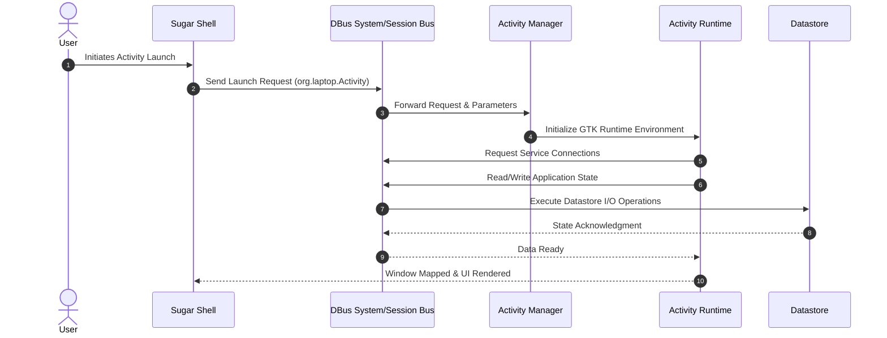

# Google Summer of Code 2026 Proposal

**Organization:** Sugar Labs  
**Project:** GTK4 Transition Part 2 Sugar Shell  
**Proposal Title:** Completing GTK4 Migration and Wayland Support for the Sugar Shell  
**Submitted by:** Dev  

## About Me

| Field | Details |
| --- | --- |
| **Name** | Dev |
| **Degree** | B.Tech in Computer Science |
| **Current Role** | Undergraduate Student |
| **Email** | kalpanagola9897@gmail.com |
| **Phone** | +91 8077907751 |
| **GitHub** | [https://github.com/dev10-sys](https://github.com/dev10-sys) |
| **LinkedIn** | [https://www.linkedin.com/in/dev10-sys](https://www.linkedin.com/in/dev10-sys) |
| **Matrix** | Dev (@dev10-sys:matrix.org) |
| **Time Zone** | IST (GMT +5:30) |
| **Coding Mentors** | Krish Pandya, Ibiam Chihurumnaya |
| **Assisting Mentors** | Walter Bender, Juan Pablo Ugarte |

## Previous Open Source Work

I have been contributing to Sugar Labs repositories, mainly focusing on the Sugar desktop environment and core shell components. My work includes fixing runtime issues, improving stability, fixing UI behavior issues, and working on GTK related migration and Wayland compatibility changes. I have worked on different parts of the Sugar desktop such as Journal, Frame, Clipboard, Control Panel, Datastore integration, and GTK related components. Along with Sugar desktop, I have also contributed to other Sugar Labs projects and open source networking test infrastructure.

### Contributions Table (Sugar Desktop – sugarlabs/sugar)

| Area | Issue | What I Did | PR Link | Status |
| :--- | :--- | :--- | :--- | :--- |
| Datastore / DBus | Datastore restart crash | Fixed stale DBus proxy issue and implemented automatic reconnection and retry logic | [https://github.com/sugarlabs/sugar/pull/1030](https://github.com/sugarlabs/sugar/pull/1030) | Merged |
| Wayland Stability | Clipboard tray display issue | Moved screen size lookup from import time to initialization to avoid Wayland startup crash | [https://github.com/sugarlabs/sugar/pull/1059](https://github.com/sugarlabs/sugar/pull/1059) | Merged |
| Wayland Stability | Runtime display access crash | Added guards for Gdk.Display and Gdk.Screen to prevent crashes during early startup | [https://github.com/sugarlabs/sugar/pull/1060](https://github.com/sugarlabs/sugar/pull/1060) | Merged |
| Control Panel | Modem configuration crash | Prevented crash when ISO country name missing by adding fallback to country code | [https://github.com/sugarlabs/sugar/pull/1061](https://github.com/sugarlabs/sugar/pull/1061) | Merged |
| Control Panel | Excess disk writes | Reused Gio.Settings instance to prevent repeated disk writes when moving age slider | [https://github.com/sugarlabs/sugar/pull/1063](https://github.com/sugarlabs/sugar/pull/1063) | Merged |
| Journal UI | Activity chooser modal issue | Set ActivityChooser transient for Journal window to ensure correct modal behavior | [https://github.com/sugarlabs/sugar/pull/1062](https://github.com/sugarlabs/sugar/pull/1062) | Open |
| Frame / Clipboard | Clipboard paste failure | Fixed paste failure when multiple clipboard items exist | [https://github.com/sugarlabs/sugar/pull/1064](https://github.com/sugarlabs/sugar/pull/1064) | Open |
| Journal | Search focus lost | Preserved search entry focus during async model refresh | [https://github.com/sugarlabs/sugar/pull/1065](https://github.com/sugarlabs/sugar/pull/1065) | Open |
| GTK4 Migration | GTK3 deprecated API migration | Migrated deprecated GTK3 container, layout, and display APIs to GTK4 equivalents across Sugar shell | [https://github.com/sugarlabs/sugar/pull/1092](https://github.com/sugarlabs/sugar/pull/1092) | Open |
| GTK4 Migration | GTK4 container migration | Replaced Gtk.VBox, Gtk.HBox, Gtk.Alignment, Gtk.EventBox and old container APIs | [https://github.com/sugarlabs/sugar/pull/1093](https://github.com/sugarlabs/sugar/pull/1093) | Open |

### Other Sugar Labs Contributions (Music Blocks)

| Project | Work | PR Link | Status |
| :--- | :--- | :--- | : :--- |
| Music Blocks v4 | Cooperative scheduler and execution monitoring system | [https://github.com/sugarlabs/musicblocks-v4-lib/pull/149](https://github.com/sugarlabs/musicblocks-v4-lib/pull/149) | Open |
| Music Blocks v4 | Recursive routine execution with call frame stack | [https://github.com/sugarlabs/musicblocks-v4-lib/pull/151](https://github.com/sugarlabs/musicblocks-v4-lib/pull/151) | Open |
| Music Blocks v4 | Variable tables by data type namespace | [https://github.com/sugarlabs/musicblocks-v4-lib/pull/152](https://github.com/sugarlabs/musicblocks-v4-lib/pull/152) | Open |

### Other Open Source Contributions (SONiC Networking)

| Project | Work | PR Link | Status |
| :--- | :--- | :--- | :--- |
| SONiC Test Infrastructure | Added IPv6 support for COPP tests and extended VOQ tests for single ASIC systems | [https://github.com/sonic-net/sonic-mgmt/pull/23181](https://github.com/sonic-net/sonic-mgmt/pull/23181) | Open |
| SONiC Test Infrastructure | Extended VOQ counter test to support single ASIC systems | [https://github.com/sonic-net/sonic-mgmt/pull/23171](https://github.com/sonic-net/sonic-mgmt/pull/23171) | Open |

These SONiC PRs add IPv6 support and extend test coverage for single ASIC VOQ systems.

Through these contributions, I have worked on different layers of the Sugar desktop including UI behavior, system integration, runtime stability, and ongoing GTK4 migration work. This experience helped me understand the Sugar shell architecture and the challenges involved in migrating a large GTK3 codebase to GTK4 while maintaining stability.

## Project Details

### What are you making

In this project I am working on migrating the Sugar Shell from GTK3 to GTK4 and improving its compatibility with Wayland based Linux systems.

From what I have studied while working on the Sugar desktop, the Sugar Shell is the core environment that manages the user interface, activity launching, Journal, and system integration. Right now most of the Sugar Shell is still based on GTK3 and some parts assume X11 behavior.

I think the main problem here is not just deprecated APIs, but platform change. The Linux desktop ecosystem is moving towards GTK4 and Wayland, and if Sugar stays on GTK3 and X11, it will become harder to run and maintain Sugar on modern systems.

So the goal of this project is not to redesign Sugar, but to keep the behavior the same and update the internal implementation so that Sugar Shell runs on GTK4 and works correctly on Wayland.

The main parts I will be working on are the Frame, Journal, Clipboard, Control Panel, and Activity launching system, because these components form the core of the Sugar desktop environment.

### System Architecture Overview

Before explaining the migration work, I want to explain how the Sugar system is structured, because the migration work depends on how different parts of the system interact with each other.

#### Sugar System Architecture

```mermaid
flowchart TD
    classDef userLayer fill:#f8f9fa,stroke:#ced4da,stroke-width:2px;
    classDef shellLayer fill:#e2e3e5,stroke:#6c757d,stroke-width:2px;
    classDef runtimeLayer fill:#d1ecf1,stroke:#17a2b8,stroke-width:2px;
    classDef osLayer fill:#fff3cd,stroke:#ffc107,stroke-width:2px;

    User([User Interactions]) ::: userLayer --> SS

    subgraph ShellLayer ["Sugar Shell Core (Python)"]
        SS[Sugar Shell Runtime] ::: shellLayer
        SS --> F[Frame UI]
        SS --> J[Journal Core]
        SS --> CP[Control Panel]
    end

    subgraph ToolkitIntegration ["UI & Binding Layer"]
        SS --> PyG[PyGObject Bindings] ::: runtimeLayer
        PyG --> GTK[GTK Framework] ::: runtimeLayer
    end

    subgraph OSLayer ["Linux System Environment"]
        GTK --> Disp["Display Server<br/>Wayland / X11"] ::: osLayer
        SS --> DBus[DBus Message Bus] ::: osLayer
        DBus <--> Data[Sugar Datastore] ::: osLayer
        DBus <--> NM[NetworkManager] ::: osLayer
        DBus <--> GS[GSettings] ::: osLayer
    end
```

**Diagram Flow (Mermaid):**
The Sugar Shell is written mostly in Python and uses PyGObject to interact with GTK. GTK then interacts with the display server which can be X11 or Wayland. The Sugar Shell also communicates with system services like DBus, GSettings, NetworkManager, and the Sugar Datastore.
This means the Sugar Shell sits between the user and the Linux system and acts as the main environment where everything runs.

### How Activities Depend on the Sugar Shell

This is important because the GTK4 migration of the Shell also affects activities.

```mermaid
flowchart LR
    classDef shell fill:#d4edda,stroke:#28a745,stroke-width:2px;
    classDef activity fill:#f8d7da,stroke:#dc3545,stroke-width:2px;
    classDef sys fill:#cce5ff,stroke:#007bff,stroke-width:1px;

    subgraph CoreEnvironment ["Core Environment"]
        SS[Sugar Shell] ::: shell -->|Manages Lifecycle| AM[Activity Manager]
    end

    AM -->|Launch Request| Act["Isolated Activity Instance<br/>e.g. Write, Browse"] ::: activity

    subgraph ShellProvidedServices ["Shell Provided Services"]
        Act -.->|State Persistence| Jour[Journal Integration] ::: sys
        Act -.->|File I/O| DS[Datastore Access] ::: sys
        Act -.->|Data Transfer| Clip[Clipboard Service] ::: sys
        Act -.->|Connection| Net[Network State] ::: sys
    end
    
    Jour -.-> SS
    DS -.-> SS
```

**Diagram Flow:**
From this architecture, I understand that activities do not run independently. They depend on the Sugar Shell for launching, saving data, accessing the Journal, clipboard, and network services.
Because of this, I think that migrating the Sugar Shell to GTK4 is a base step. Once the Shell is stable on GTK4, activities can run on top of a GTK4 environment and activity migration becomes easier and more stable.

### GTK3 to GTK4 Migration Architecture

Now the migration itself is not just replacing widgets. It is a transition from an older GTK3 and X11 based architecture to a GTK4 and Wayland compatible architecture.

```mermaid
block-beta
    columns 3
    
    %% Current Architecture
    block:Legacy:1
        Title1["Legacy Architecture"]
        GTK3["GTK3 Framework"]
        X11["X11 Display Server"]
        DepAPI["Deprecated Container/Layout APIs"]
    end

    space:1
    
    %% Target Architecture
    block:Modern:1
        Title2["Modern Architecture"]
        GTK4["GTK4 Framework"]
        Wayland["Wayland Compositor"]
        ModAPI["Modern Controllers & CSS Providers"]
    end
    
    Legacy --> Modern
```



**Diagram Flow:**
In GTK3 many APIs like old container widgets, screen based display handling, and some styling methods are deprecated. GTK4 uses new container APIs, event controllers, CSS based styling, and different display handling methods which are more compatible with Wayland.
So this migration involves updating container APIs, layout handling, display handling, styling, and input handling so that the Sugar Shell works correctly on GTK4.

### Internal Sugar Shell Components

To make the migration structured, I will work component by component inside the Sugar Shell.

```mermaid
flowchart TD
    classDef main fill:#343a40,stroke:#fff,stroke-width:2px,color:#fff;
    classDef comp fill:#e9ecef,stroke:#6c757d,stroke-width:1px;

    MainLoop[Sugar Shell Main Event Loop] ::: main

    MainLoop --> F[Frame Overlay System] ::: comp
    MainLoop --> J[Journal UI & Model] ::: comp
    MainLoop --> AL[Activity Launcher System] ::: comp
    MainLoop --> CP[Control Panel Modules] ::: comp
    MainLoop --> C[Clipboard Management] ::: comp

    %% Showing dependencies
    F -.-> AL
    J -.-> F
```
This helps in planning the migration because each of these components uses GTK widgets and display handling in different ways.

### DBus Communication Architecture

Sugar components communicate using DBus, especially for launching activities and accessing the datastore.



**Diagram Flow:**
This is important because GTK4 migration should not break DBus communication or activity lifecycle.

### What Work Will Be Done

I will divide the work into several technical parts.

**1. GTK4 API Migration**
I will replace deprecated GTK3 APIs with GTK4 equivalents. This includes container APIs, layout APIs, widget APIs, and dialog APIs. This work will be done component by component in the Sugar Shell.

**2. Display and Monitor Handling**
GTK4 uses a different display and monitor system compared to GTK3. Old screen based APIs need to be replaced with GTK4 display and monitor APIs. This is important for Wayland compatibility.

**3. Styling Migration**
Old styling methods are deprecated in GTK4, so styling will be migrated to GTK CSS using CSS providers.

**4. Wayland Compatibility**
Some parts of Sugar assume X11 behavior. These parts need to be updated so that Sugar works correctly under Wayland where some X11 specific features are not available.

**5. Testing and Stability**
After migration, I will test the Frame, Journal, Clipboard, Control Panel, and Activity launching system to make sure the system works correctly and does not crash.

### How Will It Impact Sugar Labs

The Sugar Shell is the main environment where all activities run. Activities depend on the Sugar Shell for launching, window management, datastore access, Journal integration, and system services.
Because of this, I think that migrating the Sugar Shell to GTK4 is a base platform step. Once the Shell runs on GTK4 and Wayland, activities can be migrated and tested on a stable GTK4 environment.

Right now many Linux distributions have already moved to Wayland and GTK4, but Sugar is still mostly based on GTK3 and X11. If Sugar is not migrated, it may face compatibility and maintenance problems in the future.
So I see this project not just as a UI migration, but as a platform transition that helps Sugar run on modern Linux systems and makes future development easier.

### Technologies I Will Be Using

| Component | Technology |
| :--- | :--- |
| **Programming Language** | Python 3 |
| **GUI Framework** | GTK3 to GTK4 |
| **Python Bindings** | PyGObject |
| **Display Systems** | Wayland and X11 |
| **IPC** | DBus |
| **Settings** | GSettings |
| **Storage** | Sugar Datastore |
| **Build System** | Autotools |
| **Styling** | GTK CSS |
| **Networking** | NetworkManager |

Most of the Sugar Shell code is written in Python and uses PyGObject to interact with GTK, so most of the migration work will involve updating GTK APIs and display handling in Python code.
